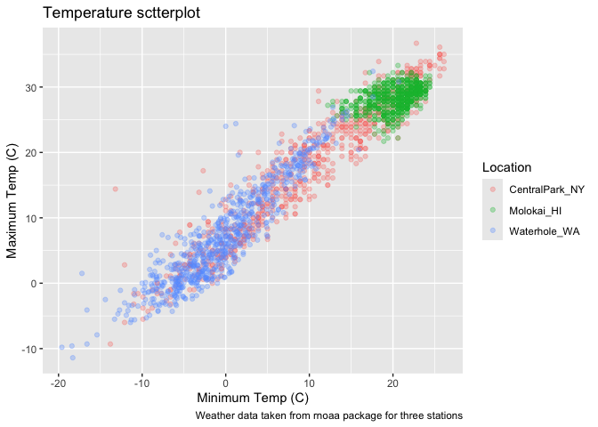
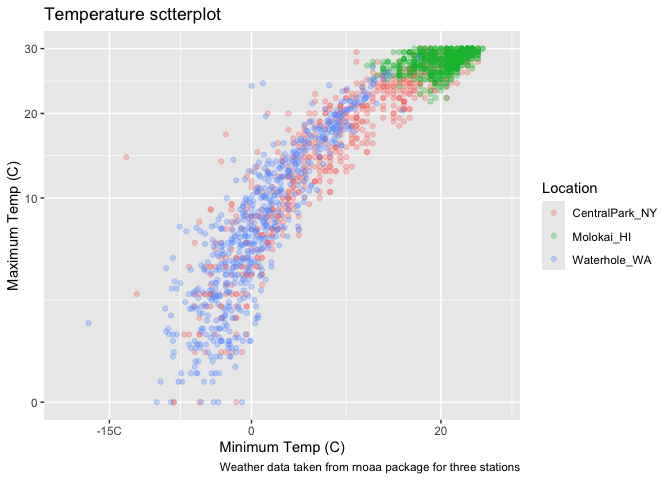
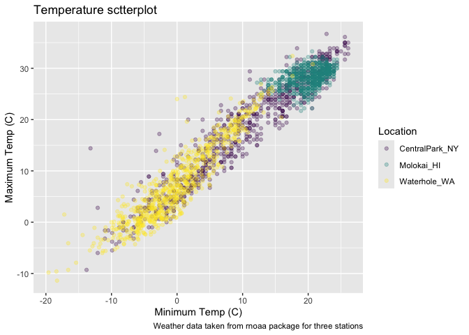
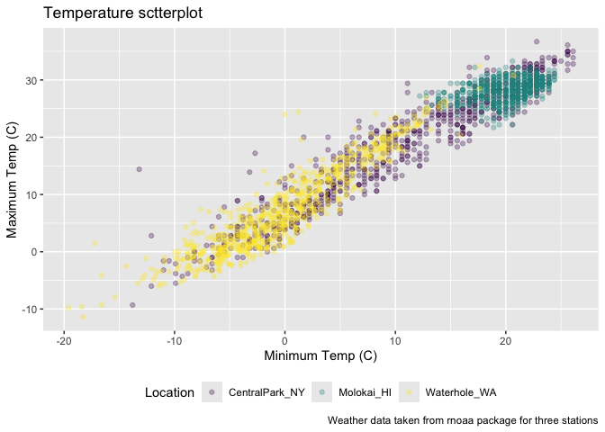
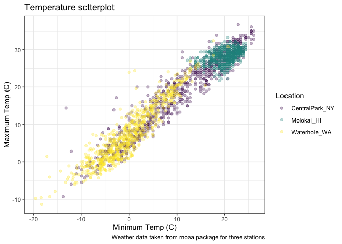
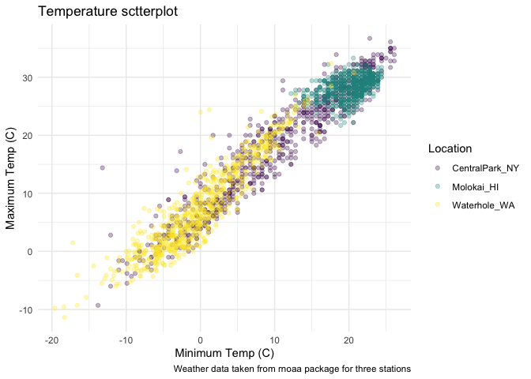
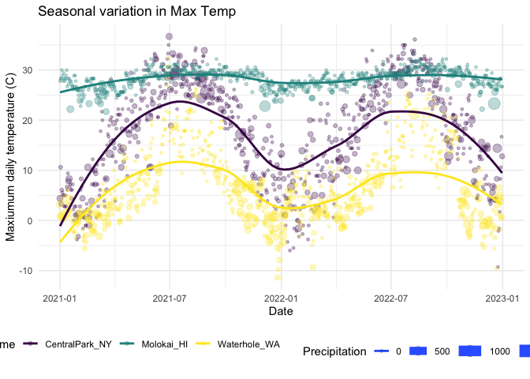
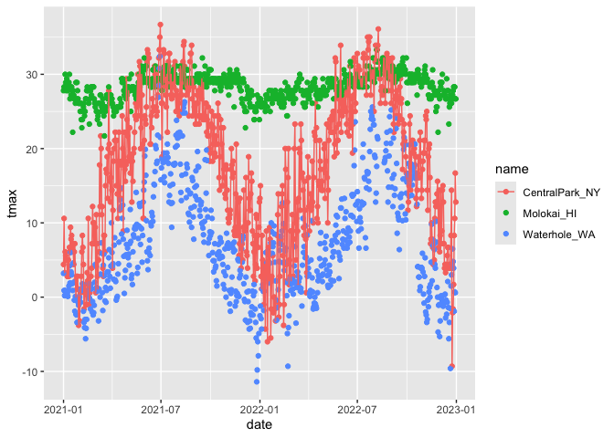
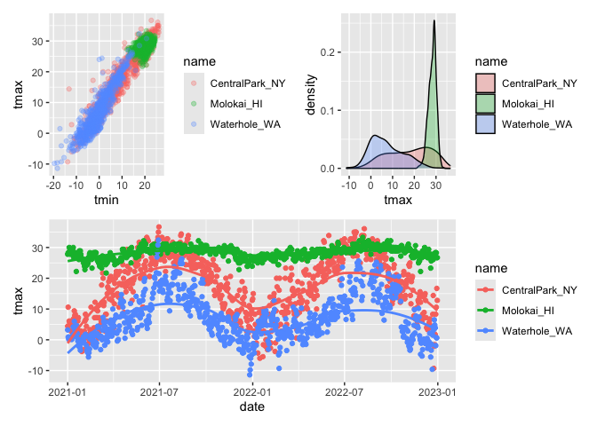
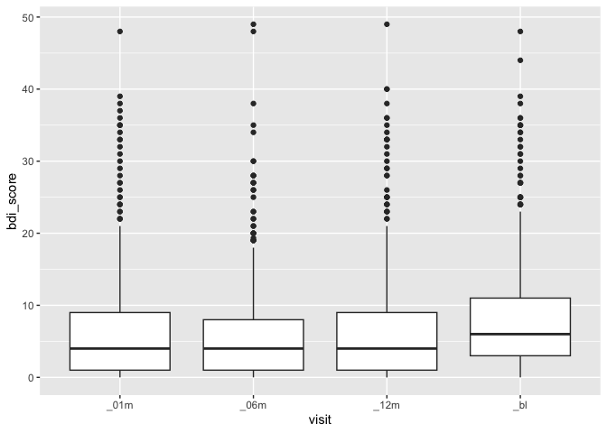

viz_and eda
================
cathy
2024-10-01

This is for visualization with ggplot2 project!

``` r
library(tidyverse)
```

    ## ── Attaching core tidyverse packages ──────────────────────── tidyverse 2.0.0 ──
    ## ✔ dplyr     1.1.4     ✔ readr     2.1.5
    ## ✔ forcats   1.0.0     ✔ stringr   1.5.1
    ## ✔ ggplot2   3.5.1     ✔ tibble    3.2.1
    ## ✔ lubridate 1.9.3     ✔ tidyr     1.3.1
    ## ✔ purrr     1.0.2     
    ## ── Conflicts ────────────────────────────────────────── tidyverse_conflicts() ──
    ## ✖ dplyr::filter() masks stats::filter()
    ## ✖ dplyr::lag()    masks stats::lag()
    ## ℹ Use the conflicted package (<http://conflicted.r-lib.org/>) to force all conflicts to become errors

``` r
library(patchwork)
library(ggplot2)
library(haven)
```

``` r
weather_df = 
  rnoaa::meteo_pull_monitors(
    c("USW00094728", "USW00022534", "USS0023B17S"),
    var = c("PRCP", "TMIN", "TMAX"), 
    date_min = "2021-01-01",
    date_max = "2022-12-31") |>
  mutate(
    name = case_match(
      id, 
      "USW00094728" ~ "CentralPark_NY", 
      "USW00022534" ~ "Molokai_HI",
      "USS0023B17S" ~ "Waterhole_WA"),
    tmin = tmin / 10,
    tmax = tmax / 10) |>
  select(name, id, everything())
```

    ## using cached file: /Users/caiqi/Library/Caches/org.R-project.R/R/rnoaa/noaa_ghcnd/USW00094728.dly

    ## date created (size, mb): 2024-09-26 10:31:38.21687 (8.651)

    ## file min/max dates: 1869-01-01 / 2024-09-30

    ## using cached file: /Users/caiqi/Library/Caches/org.R-project.R/R/rnoaa/noaa_ghcnd/USW00022534.dly

    ## date created (size, mb): 2024-09-26 10:31:44.045888 (3.932)

    ## file min/max dates: 1949-10-01 / 2024-09-30

    ## using cached file: /Users/caiqi/Library/Caches/org.R-project.R/R/rnoaa/noaa_ghcnd/USS0023B17S.dly

    ## date created (size, mb): 2024-09-26 10:31:46.03149 (1.036)

    ## file min/max dates: 1999-09-01 / 2024-09-30

Make a scartterplot but fancy this time.

``` r
 weather_df |> 
  ggplot(aes(x = tmin, y = tmax, color = name)) +
  geom_point(alpha = .3) +
  labs(
    title = "Temperature sctterplot",
    x = "Minimum Temp (C)",
    y = "Maximum Temp (C)",
    color = "Location",
    caption = "Weather data taken from rnoaa package for three stations"
  )
```

    ## Warning: Removed 17 rows containing missing values or values outside the scale range
    ## (`geom_point()`).

<!-- -->

Scales – star with ‘x’ and ‘y’

``` r
 weather_df |> 
  ggplot(aes(x = tmin, y = tmax, color = name)) +
  geom_point(alpha = .3) +
  labs(
    title = "Temperature sctterplot",
    x = "Minimum Temp (C)",
    y = "Maximum Temp (C)",
    color = "Location",
    caption = "Weather data taken from rnoaa package for three stations"
  ) +
  scale_x_continuous(
    breaks = c (-15, 0, 20),
    labels = c("-15C", "0", "20")
  ) +
  scale_y_continuous(
    limits = c (0,30),
    transform = "sqrt"
  )
```

    ## Warning in transformation$transform(x): NaNs produced

    ## Warning in scale_y_continuous(limits = c(0, 30), transform = "sqrt"): sqrt
    ## transformation introduced infinite values.

    ## Warning: Removed 302 rows containing missing values or values outside the scale range
    ## (`geom_point()`).

<!-- -->

Look at color:

``` r
ggp_scatterplot = 
 weather_df |> 
  ggplot(aes(x = tmin, y = tmax, color = name)) +
  geom_point(alpha = .3) +
  labs(
    title = "Temperature sctterplot",
    x = "Minimum Temp (C)",
    y = "Maximum Temp (C)",
    color = "Location",
    caption = "Weather data taken from rnoaa package for three stations"
      ) +
  viridis::scale_color_viridis(discrete = TRUE)

ggp_scatterplot 
```

    ## Warning: Removed 17 rows containing missing values or values outside the scale range
    ## (`geom_point()`).

<!-- -->

also can use ” scale_color_hue(h = c(100, 400)” to change the number,
change the color

## Themes

``` r
ggp_scatterplot +
  theme(legend.position = "bottom")
```

    ## Warning: Removed 17 rows containing missing values or values outside the scale range
    ## (`geom_point()`).

<!-- -->

change the background black and white have order matters

show different types of the plot virsion

``` r
ggp_scatterplot +
  theme_bw() +
  theme(legend.position = "bottom")
```

    ## Warning: Removed 17 rows containing missing values or values outside the scale range
    ## (`geom_point()`).

<!-- -->

``` r
ggp_scatterplot +
  theme(legend.position = "bottom") +
  theme_bw()
```

    ## Warning: Removed 17 rows containing missing values or values outside the scale range
    ## (`geom_point()`).

<!-- -->

``` r
ggp_scatterplot +
  theme(legend.position = "bottom") +
  theme_minimal()
```

    ## Warning: Removed 17 rows containing missing values or values outside the scale range
    ## (`geom_point()`).

<!-- -->

``` r
ggp_scatterplot +
  theme(legend.position = "bottom") +
  theme_classic()
```

    ## Warning: Removed 17 rows containing missing values or values outside the scale range
    ## (`geom_point()`).

<!-- -->

Learning assessment

``` r
 weather_df |> 
  ggplot(aes(x= date, y =tmax, color = name, size = prcp)) +
  geom_point(alpha = .3) +
  geom_smooth(se = FALSE) +
  viridis::scale_color_viridis(discrete = TRUE) + 
  labs(
    x = "Date",
    y = "Maxiumum daily temperature (C)",
    title = "Seasonal variation in Max Temp",
    size = "Precipitation"
 ) +
  theme_minimal() + 
  theme(legend.position = "bottom")
```

    ## Warning: Using `size` aesthetic for lines was deprecated in ggplot2 3.4.0.
    ## ℹ Please use `linewidth` instead.
    ## This warning is displayed once every 8 hours.
    ## Call `lifecycle::last_lifecycle_warnings()` to see where this warning was
    ## generated.

    ## `geom_smooth()` using method = 'loess' and formula = 'y ~ x'

    ## Warning: Removed 17 rows containing non-finite outside the scale range
    ## (`stat_smooth()`).

    ## Warning: The following aesthetics were dropped during statistical transformation: size.
    ## ℹ This can happen when ggplot fails to infer the correct grouping structure in
    ##   the data.
    ## ℹ Did you forget to specify a `group` aesthetic or to convert a numerical
    ##   variable into a factor?

    ## Warning: Removed 19 rows containing missing values or values outside the scale range
    ## (`geom_point()`).

<!-- -->

Extra bonus stuff in ‘ggplot’

Use different datasets in differernt ’gemo’s

``` r
central_park_df =
  weather_df |> 
  filter(name == "CentralPark_NY")

molokai_df =
  weather_df |> 
  filter(name == "Molokai_HI")

 weather_df |> 
  ggplot(aes(x = date, y =tmax, color= name)) +
  geom_point() +
  geom_line(data = central_park_df)
```

    ## Warning: Removed 17 rows containing missing values or values outside the scale range
    ## (`geom_point()`).

<!-- -->

## Multiple panels

good to seperate by names

``` r
weather_df |> 
  ggplot(aes(x = tmax, fill =name)) +
  geom_density() +
  facet_grid(. ~ name)
```

    ## Warning: Removed 17 rows containing non-finite outside the scale range
    ## (`stat_density()`).

<!-- -->

put different graph together

``` r
ggp_tmax_tmin = 
  weather_df |> 
  ggplot(aes(x = tmin, y = tmax, color =name)) +
  geom_point(alpha = .3)


ggp_tmax_density = 
  weather_df |> 
  ggplot(aes(x = tmax, fill = name)) +
  geom_density(alpha = .3) 

ggp_tmax_date =
  weather_df |> 
  ggplot(aes(x = date, y = tmax, color =name)) +
  geom_point() +
  geom_smooth(se = FALSE)

  (ggp_tmax_tmin + ggp_tmax_density)/ ggp_tmax_date 
```

    ## Warning: Removed 17 rows containing missing values or values outside the scale range
    ## (`geom_point()`).

    ## Warning: Removed 17 rows containing non-finite outside the scale range
    ## (`stat_density()`).

    ## `geom_smooth()` using method = 'loess' and formula = 'y ~ x'

    ## Warning: Removed 17 rows containing non-finite outside the scale range
    ## (`stat_smooth()`).

    ## Warning: Removed 17 rows containing missing values or values outside the scale range
    ## (`geom_point()`).

<!-- -->

try to remove every theme, but only remove one ggp_together =
(ggp_tmax_tmin + ggp_tmax_density)/ ggp_tmax_date +
theme(legend.position = “none”) need to remove for each graph first

## Data manipulation

``` r
weather_df |> 
  ggplot(aes(x = name, y = tmax, fill =name)) +
  geom_violin(alpha =.5)
```

    ## Warning: Removed 17 rows containing non-finite outside the scale range
    ## (`stat_ydensity()`).

<!-- -->

``` r
weather_df |> 
  mutate(name = forcats::fct_relevel(name, c("Molokai_HI", "CentralPark_NY", "Waterhole_WA"))) |> 
  ggplot(aes(x = name, y = tmax, fill =name)) +     
  geom_violin(alpha =.5)
```

    ## Warning: Removed 17 rows containing non-finite outside the scale range
    ## (`stat_ydensity()`).

<!-- -->

PULSE data next.

``` r
pulse_df =
  read_sas("data/public_pulse_data.sas7bdat") |> 
  janitor::clean_names() |> 
  pivot_longer(
    cols = bdi_score_bl:bdi_score_12m,
    names_to = "visit",
    values_to = "bdi_score",
    names_prefix = "bdi_score"
  ) |> 
  mutate(visit = ifelse(visit == "bl", "00m", visit))

pulse_df|> 
  ggplot(aes(x = visit, y = bdi_score)) +
  geom_boxplot()
```

    ## Warning: Removed 879 rows containing non-finite outside the scale range
    ## (`stat_boxplot()`).

<!-- -->

Make an FAS plot

``` r
 litters_df =
   read_csv("data/FAS_litters.csv", na = c("NA",".","")) |> 
   janitor::clean_names() |> 
   separate(group, into = c("dose","tx_day"), 3)
```

    ## Rows: 49 Columns: 8
    ## ── Column specification ────────────────────────────────────────────────────────
    ## Delimiter: ","
    ## chr (2): Group, Litter Number
    ## dbl (6): GD0 weight, GD18 weight, GD of Birth, Pups born alive, Pups dead @ ...
    ## 
    ## ℹ Use `spec()` to retrieve the full column specification for this data.
    ## ℹ Specify the column types or set `show_col_types = FALSE` to quiet this message.

``` r
pups_df =
  read_csv("data/FAS_pups.csv", na = c("NA",".","")) |> 
  janitor::clean_names() |> 
  pivot_longer(
    pd_ears:pd_walk,
    names_to = "outcome",
    values_to = "pn_day",
    names_prefix = "pd_"
  )
```

    ## Rows: 313 Columns: 6
    ## ── Column specification ────────────────────────────────────────────────────────
    ## Delimiter: ","
    ## chr (1): Litter Number
    ## dbl (5): Sex, PD ears, PD eyes, PD pivot, PD walk
    ## 
    ## ℹ Use `spec()` to retrieve the full column specification for this data.
    ## ℹ Specify the column types or set `show_col_types = FALSE` to quiet this message.

``` r
fas_df =
    left_join(pups_df, litters_df, by ="litter_number")


fas_df |>
  drop_na(tx_day) |> 
  ggplot(aes(x = dose, y = pn_day)) +
  geom_boxplot() +
  facet_grid(tx_day ~ outcome)
```

    ## Warning: Removed 42 rows containing non-finite outside the scale range
    ## (`stat_boxplot()`).

<!-- -->
